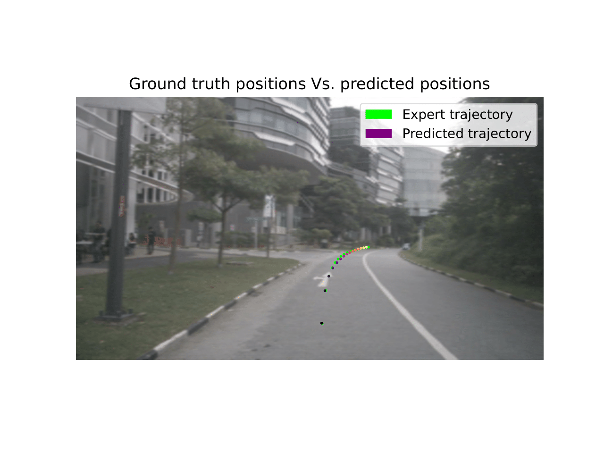
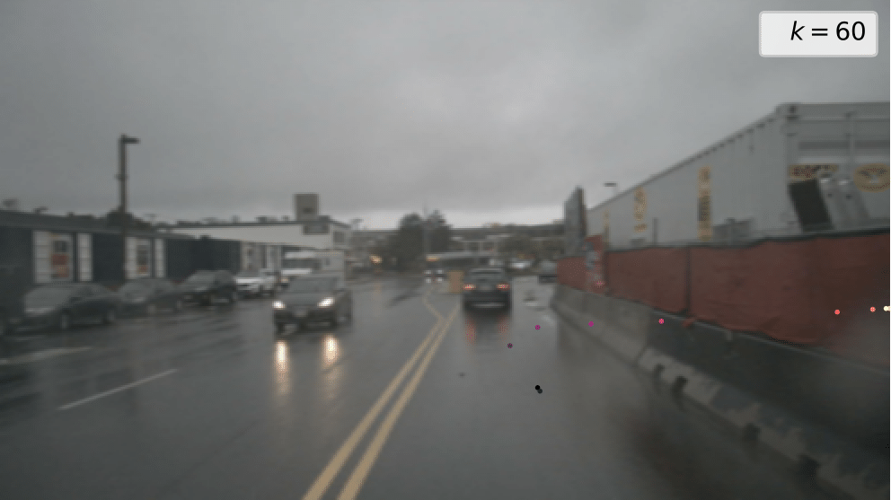
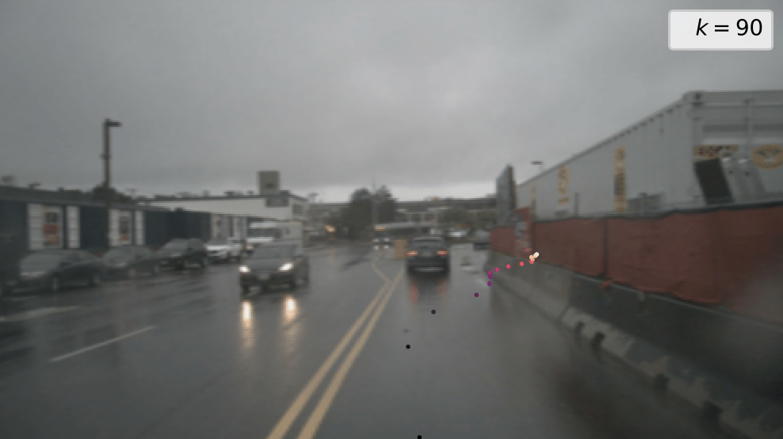
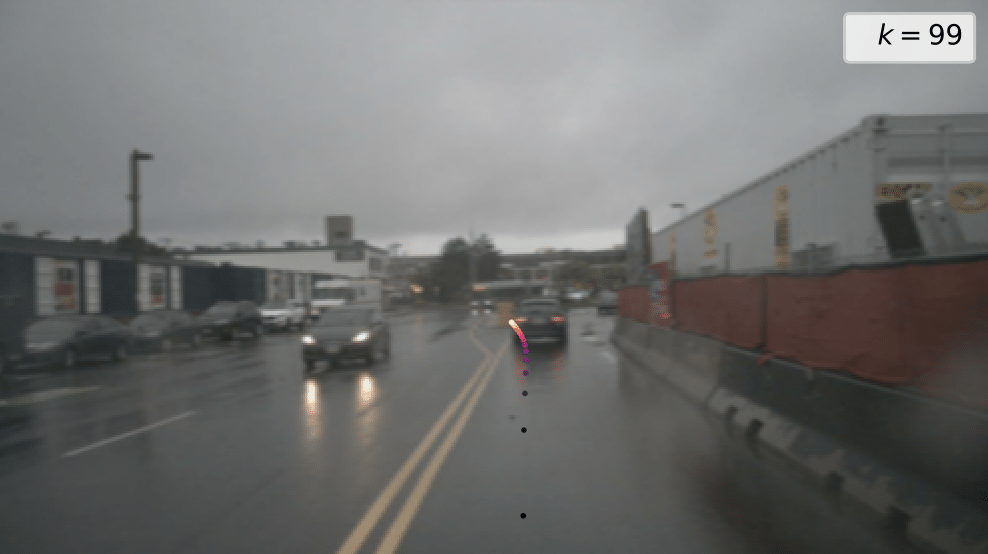

# DPfAV - Diffusion Policy for Autonmous Vehicles

    

    
    
    

## Description
The DPfAV is based on the work done by [Chi](https://github.com/real-stanford/diffusion_policy/tree/main) which is implemented for robot arms. This implementation simply transfers this model over to the domain of autonomous driving.

### Input
The input to the model is only the two past front camera images and positions.

### Output
DPfAV has two variations, one with positions (x, y, yaw) and one with command (velocity and steering angle). 

## Dataset
The model is trained on the [nuScenes dataset](https://www.nuscenes.org/nuscenes).

## Results

* Open-loop planning results on [nuScenes](https://github.com/hustvl/VAD/tree/main). The results in the table is colletcted from [VAD](https://github.com/hustvl/VAD/tree/main).

| Method   | L2 (m) 1s | L2 (m) 2s | L2 (m) 3s | Col. (%) 1s | Col. (%) 2s | Col. (%) 3s |
|----------|-----------|-----------|-----------|-------------|-------------|-------------|
| ST-P3    | 1.33      | 2.11      | 2.90      | 0.23        | 0.62        | 1.27        |
| UniAD    | 0.48      | 0.96      | 1.65      | 0.05        | 0.17        | 0.71        |
| VAD-Tiny | 0.46      | 0.76      | 1.12      | 0.21        | 0.35        | 0.58        |
| VAD-Base | 0.41      | 0.70      | 1.05      | 0.07        | 0.17        | 0.41        |
| DPfAV positions | 0.92 | 1.16 | 1.34 | 0.09 | 0.15 | 0.21
| DPfAV commands | 5.08 | 5.08 | 5.11 | 0.09 | 0.16 | 0.24

